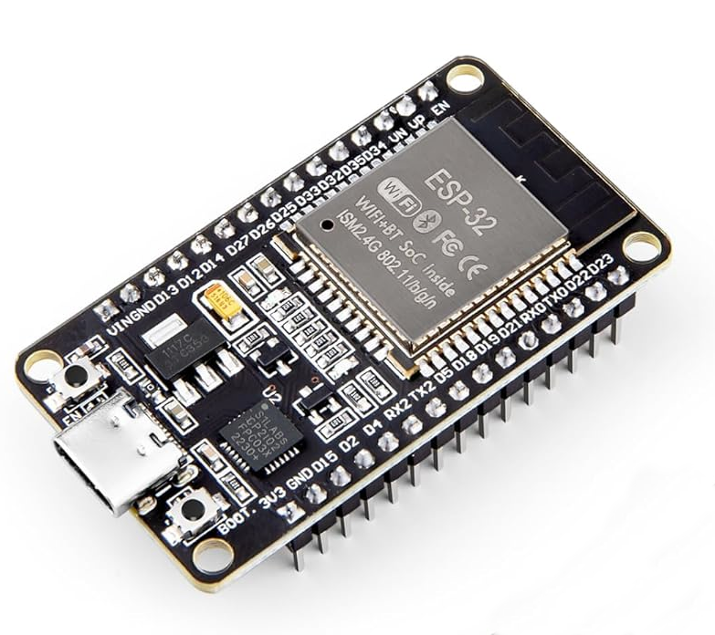
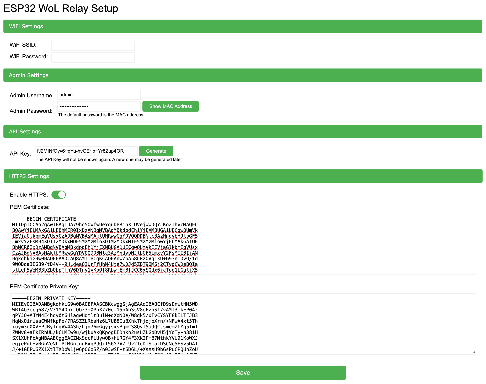
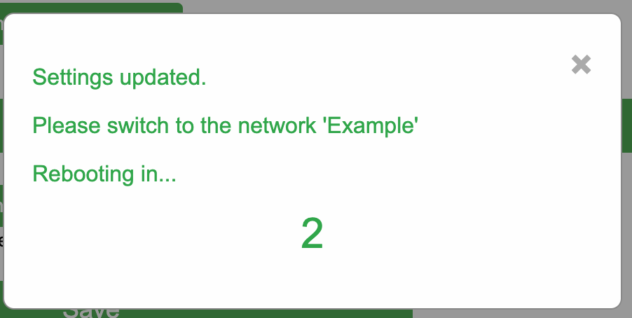
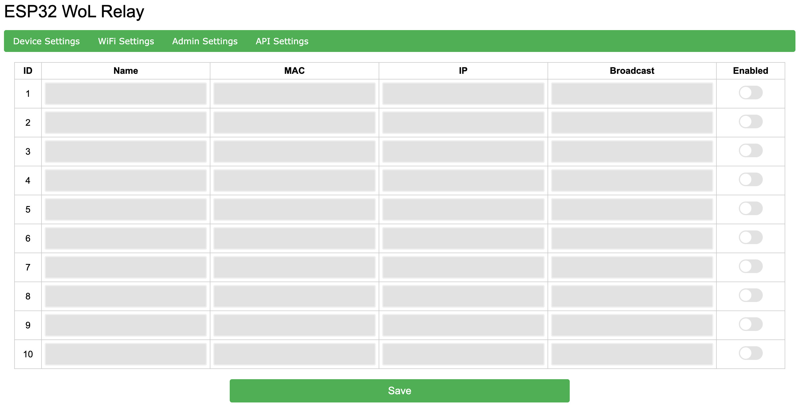
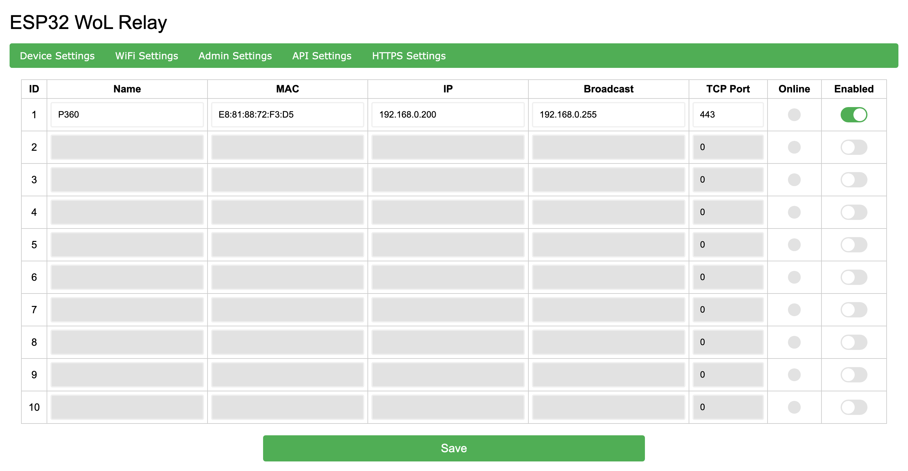
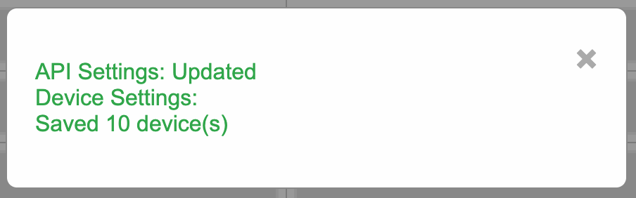

# Overview
The 'ESP32-WoL-Relay' project was born from a need to have an always on device that could wake up another device on a seperate VLAN. The 'relay' had to,

1. Run all the time
2. Be low powered
3. Work accross broadcast domains (VLANS etc.) via a REST API
4. Allow for easy updating of settings
5. No external web dependencies



# Features
- Built using the Platformio framework in VS Code 
- Supports 10 WoL devices
- Web setup and administration
- No external web dependancies (works fine on an offline network)
- REST API for device status
- REST API to wake remote devices


# Required hardware 
- ESP32 Devkit or similar clone with at least 4MB of flash
- Appropriate USB cable for power
- Case (optional)


# Getting started
This guide is not intended to cover how to install VS Code and Platformio, or how to complie the firmware and upload it. It is assumed the reader is reasonably familiar with that process and basic computer networking. If not, take a look at the [Platformio](https://platformio.org/) documentation.

The general workflow is,

1. Download the code and open with Platformio in VS Code
2. Build and upload hte firmware
3. Build and upload the filesystem image
4. Reboot the ESP32 and connect to the new network called `ESP32 WoL Relay`

## Inital setup
Upon first boot the relay will automatically create a new network called `ESP32 WoL Relay` and have the IP address `192.168.4.1`. Connect to this network and open a web browser and navigate to the IP address to see the initial setup page



Once the various settings have been configured click 'Save'. If successful a message will be shown prompting to change to the specified network. 



Once on the specified network navitage to the relay's IP address that is handed out by DHCP.

> [!IMPORTANT]
> If the relay connot successfully connect to the specified network due to it being unavailable or incorrect details have been supplied, it will automatically revert back to the setup network and IP address.

## Device setup
After the initial setup is complete the main webpage is displayed that allows various settings to be set, but more importantly specify the devices to control. You will have to login via the credentials specified on the setup page.

> [!NOTE]
> Due to the limited processing power on the ESP32 https has not been implemented. While it is unlikely packets are being sniffed accross your network, they could, and this means your admin username, password and API key could be intercepted. It is recommended to only allow access to the relay from trusted hosts.



Each device has the following settings, friendly name (optional), MAC address (required), IP address (required), broadcast IP address (required) and an enable/disable option. 



> [!WARNING]
> When a device is 'disabled' it will not be shown in API queries and will not respond to API wake commands.

After entering all of the required information and clicking 'Save', a notifcation of what was updated will be shown.

If you change the WiFi SSID or password it will not be applied until the next boot.



> [!NOTE]
> The 'Save' button saves data accross all tabs, not just the data shown on the individual tab.

> [!NOTE]
> All 10 device rows are saved, even if they are blank. If a device row contains invalid data it will be reported as invalid and not saved.

## REST API
The REST API is the interesting part, as this is what allows you to wake a device on another network segment. Being a REST API it is easy to script wake-up commands during other tasks (e.g. wake the backup server on the secure network) and control what has access via standard HTTP firewall rules.

Currently, all API endpoints are read-only. No settings can be updated/changed via the API. The only 'dangerous' command is to wake up a remote device.

Below are the endpoints, examples of their returned data and a brief description

> [!IMPORTANT]
> When sending an API request the API Key must be specified in either the header as a key (X-API-Key) value pair or as part of the query string e.g. /api/device?id=1&apikey=abc123

### Endpoint - /api/device
Returns information on the specified device.

#### Example query
Method - GET

With API Key header  
http://relay-ip/api/device?id=1  
http://relay-ip/api/device?name=P360

With API Key in request  
http://relay-ip/api/device?id=1&apikey=abc123  
http://relay-ip/api/device?name=P360&apikey=abc123

#### Example responses
Successful response
``` JSON
{
  "id": 1,
  "name": "P360",
  "enabled": true,
  "online": true
}
```

Disabled device
``` JSON
{
  "error": "Device disabled"
}
```

Invalid device
``` JSON
{
  "error": "Device ID invalid"
}
```

Invalid credentials
``` JSON
{
  "error": "Invalid credentials"
}
```

### Endpoint - /api/devices
Returns information on all of the *enabled* devices. 

#### Example query
Method - GET

With API Key header  
http://relay-ip/api/devices

With API Key in request  
http://relay-ip/api/devices?apikey=abc123

#### Example responses
Successful response
``` JSON
[
  {
    "id": 1,
    "name": "P360",
    "online": true
  },
  {
    "id": 2,
    "name": "NAS",
    "online": false
  }
]
```

Invalid credentials
``` JSON
{
  "error": "Invalid credentials"
}
```

### Endpoint - /api/wak
Wakes up the specified device

Method - POST

With API Key header  
http://relay-ip/api/wake?id=1

With API Key in request  
http://relay-ip/api/wake?id=1&apikey=abc123

#### Example responses
Successful response

``` JSON
{
  "success": true,
  "id": 1,
  "name": "P360"
}
```

Unsuccessful response

``` JSON
{
  "success": false,
  "id": 1,
  "name": "P360"
}
```

Invalid credentials

``` JSON
{
  "error": "Invalid credentials"
}
```

# Factory reset
The relay can be reset by holding down the `boot` button for 5-10 seconds. The onboard LED will flash 5 times and then the relay will reboot and be factory reset.

# Troubleshooting
Extensive debug messages are sent over the serial terminal using a baud rate of `115200`. These may be enabled by compiling the firmware with `#define DEBUG 1` set in the `config.h` file. It is not reccomended to use the debug all the time as it outputs all stored information, in plain text.

# AI statement
AI was primarily used to create/suggest blocks of code. It has not been the creator of all content and all content has been reviewed by a human. It has been used as a tool to assit with the creation of the project, just like VS Code, Platformio and various web sources etc. If you object to this, that is fine, you do not have to use the project.

# Attributions
The 'favicon' was created by Donnnno and is provided by [https://svgicons.com/icon/10081/wakeonlan](https://svgicons.com/icon/10081/wakeonlan) under the [CC BY-SA 4.0](https://creativecommons.org/licenses/by-sa/4.0/) license